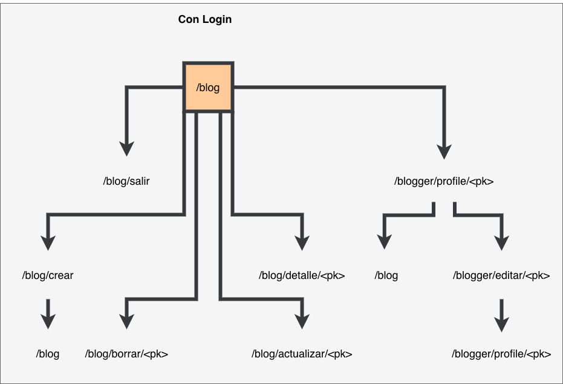
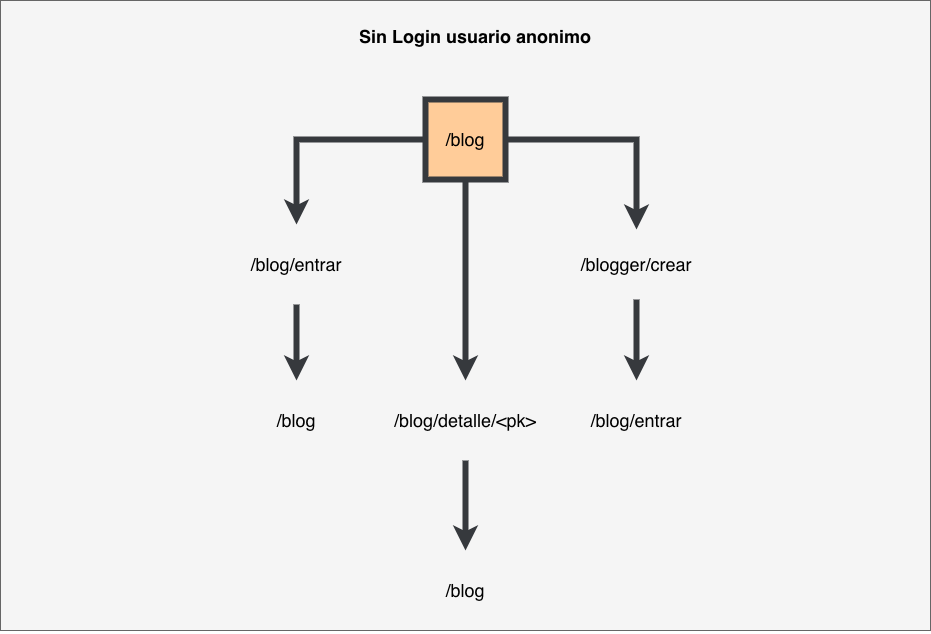

[](https://heroku.com/deploy?template=https://github.com/martinezger/Coderhouse-german-blog/tree/heroku-deploy)

# Coderhouse-german-blog
Ejemplo de Class Based Views

Para poder correr el ejemplo asegurese que tiene django instalado en su pc, luego ejecute los siguientes pasos:

```bash
python manage.py migrate
python manage.py runserver
```

Luego ingrese a [http://localhost:8000/blog](http://localhost:8000/blog)

# Site Maps




